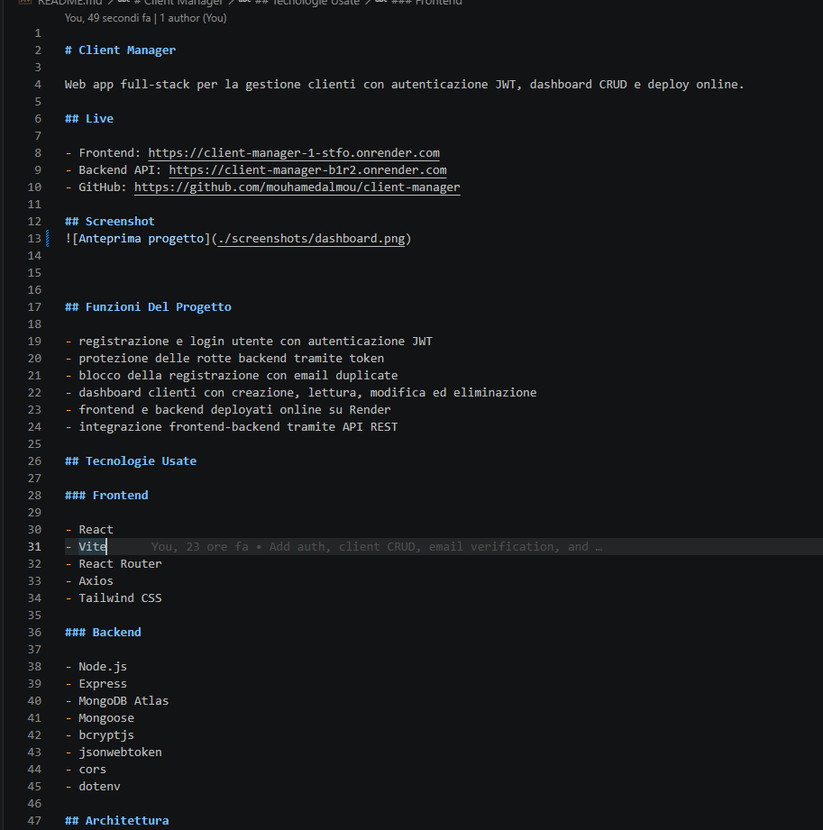

# Client Manager

Web app full-stack per la gestione clienti con autenticazione JWT, dashboard CRUD e deploy online.

## Live

- Frontend: https://client-manager-1-stfo.onrender.com
- Backend API: https://client-manager-b1r2.onrender.com
- GitHub: https://github.com/mouhamedalmou/client-manager

## Screenshot

>


## Funzioni Del Progetto

- registrazione e login utente con autenticazione JWT
- protezione delle rotte backend tramite token
- blocco della registrazione con email duplicate
- dashboard clienti con creazione, lettura, modifica ed eliminazione
- frontend e backend deployati online su Render
- integrazione frontend-backend tramite API REST

## Tecnologie Usate

### Frontend

- React
- Vite
- React Router
- Axios
- Tailwind CSS

### Backend

- Node.js
- Express
- MongoDB Atlas
- Mongoose
- bcryptjs
- jsonwebtoken
- cors
- dotenv

## Architettura

```text
client-manager/
|-- client/
|   |-- src/
|   |   |-- pages/
|   |   |-- services/
|   |   `-- assets/
|   |-- package.json
|   `-- README.md
|-- server/
|   |-- controllers/
|   |-- middleware/
|   |-- models/
|   |-- routes/
|   |-- services/
|   |-- package.json
|   `-- server.js
`-- README.md
```

## Avvio Locale

### Backend

```powershell
cd server
npm install
npm run dev
```

Variabili ambiente principali:

```env
MONGO_URI=your-mongodb-uri
JWT_SECRET=your-jwt-secret
CORS_ORIGIN=http://localhost:5173
APP_BASE_URL=http://localhost:5173
```

### Frontend

```powershell
cd client
npm install
npm run dev
```

Configurazione API:

```env
VITE_API_URL=http://localhost:3000/api
```

## API Principali

### Auth

- `POST /api/auth/register`
- `POST /api/auth/login`

### Clients

- `GET /api/clients`
- `POST /api/clients`
- `PUT /api/clients/:id`
- `DELETE /api/clients/:id`

## Testo Per CV O Profilo Freelance

Puoi usare una descrizione come questa:

> Ho sviluppato una web app full-stack per la gestione clienti con autenticazione JWT, backend Express/MongoDB e frontend React deployato online. L'app include login, registrazione, dashboard CRUD per i clienti e integrazione completa tra frontend e API REST.

Puoi inserire anche:

- GitHub: https://github.com/mouhamedalmou/client-manager
- Live demo: https://client-manager-1-stfo.onrender.com

## Note

- `node_modules` e i file `.env` non vanno committati nel repository
- il backend usa environment variables per i segreti
- il progetto e pensato come portfolio project full-stack pronto da mostrare online
